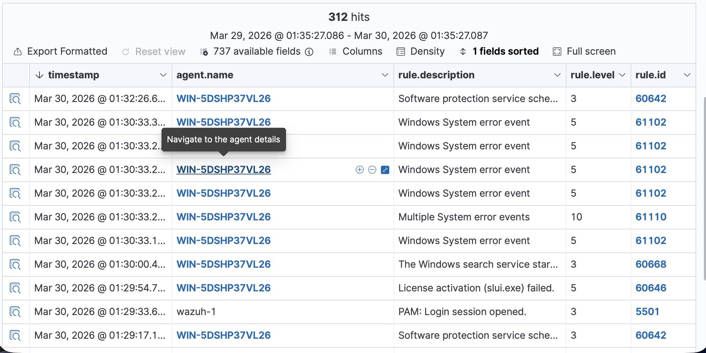
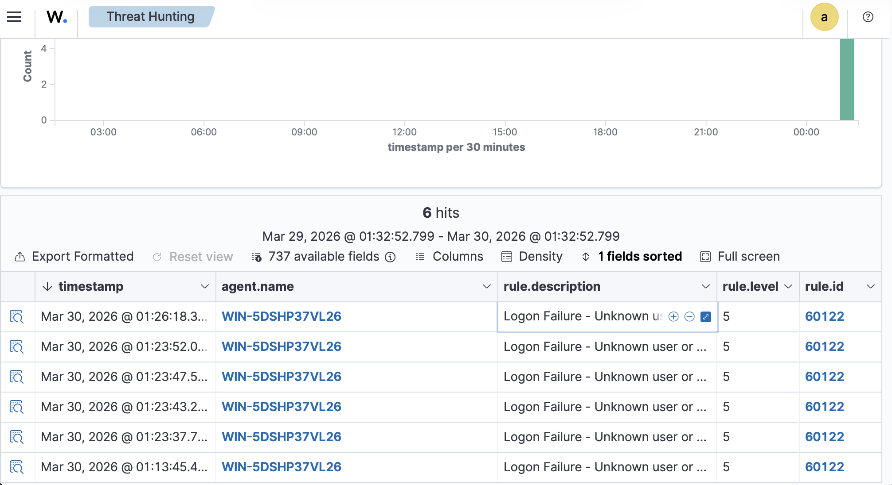

# 🧪 LAB 005 - Brute Force Detection with Wazuh

## Objective

In this lab, I simulated brute force behavior by generating multiple failed login attempts on a Windows endpoint and monitoring the activity in Wazuh. The goal was to detect the failed logons, isolate the activity, analyze the pattern, and map the behavior to a known MITRE ATT&CK technique.

---

## Lab Environment

- Wazuh server on Ubuntu
- Windows endpoint with Wazuh agent installed
- MacBook Air as the host machine
- Wazuh dashboard for monitoring

---

## Attack Simulation

To simulate brute force activity, I manually triggered multiple failed login attempts on the Windows system.

Steps performed:
- Locked the Windows system
- Entered the wrong password multiple times
- Generated repeated failed authentication events

This created Windows logon failure logs that were forwarded to Wazuh.

---

## Detection in Wazuh

Wazuh successfully detected the failed login activity from the Windows endpoint.

Key detection details:
- Rule ID: 60122
- Description: Logon Failure - Unknown user or bad password
- Endpoint: WIN-5DSHP37VL26

### Screenshot

---

## Filtering the Activity

To isolate the relevant events, I filtered the logs using:

rule.id:60122

This narrowed the results to failed login attempts only.

What stood out:
- Multiple failed login attempts
- Events occurring seconds apart
- Repeated activity from the same endpoint

### Screenshot

---

## Investigation

After filtering the activity, I reviewed individual log entries to understand the behavior.

From the logs:
- Multiple authentication failures were confirmed
- Events followed a tight timeline
- Activity showed a repeated access attempt pattern

### Screenshot

---

## Attack Identification

The repeated failed login attempts within a short timeframe indicate brute force behavior.

This type of activity is commonly used to gain unauthorized access through repeated password attempts.

---

## MITRE ATT&CK Mapping

- T1110 - Brute Force

---

## Conclusion

In this lab, I:

- Simulated repeated failed login attempts
- Detected the activity using Wazuh
- Filtered logs using rule ID 60122
- Investigated the event pattern
- Identified brute force behavior
- Mapped the activity to MITRE ATT&CK

This lab reinforced core SOC skills such as detection, log analysis, and recognizing attack patterns.

---

## Screenshots

- Wazuh dashboard overview
- Detection logs
- Filtered results
- Log investigation details
